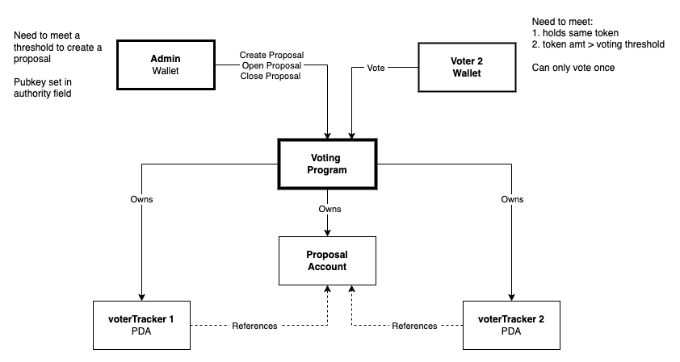

# solana-bootcamp-project

This repository contains the source code for the team project of Solana bootcamp: a voting program:

### Admin

Anyone (Admin) with certain token amout can create a proposal for vote:
- Each proposal is for a specific token (determined the token account the admin uses to create it).
- Each proposal has an unique proposal ID for the specific token. 
- The Admin can open the proposal for vote or close the proposal for vote.

### Voter

In order to cast a vote, the voter needs to meet the following criteria:
- Has a token account for the specificed token as specified in the proposal.
- Hold certain amount of token as specified in the proposal.
- Can only vote once.